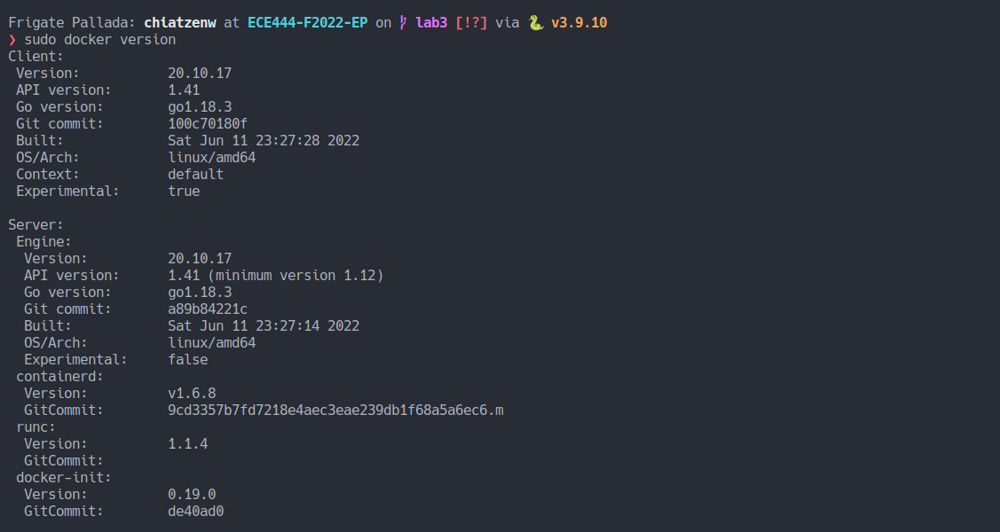
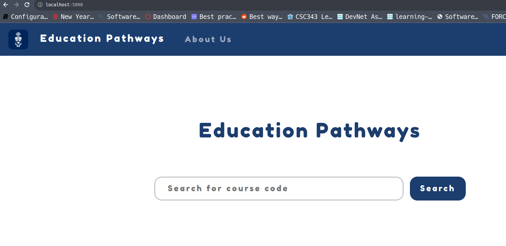
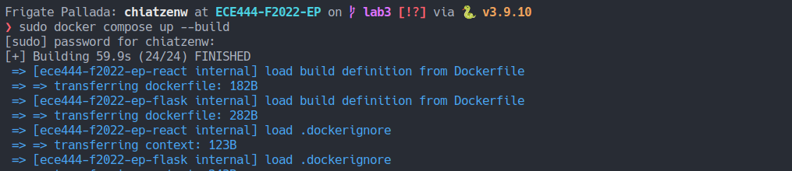
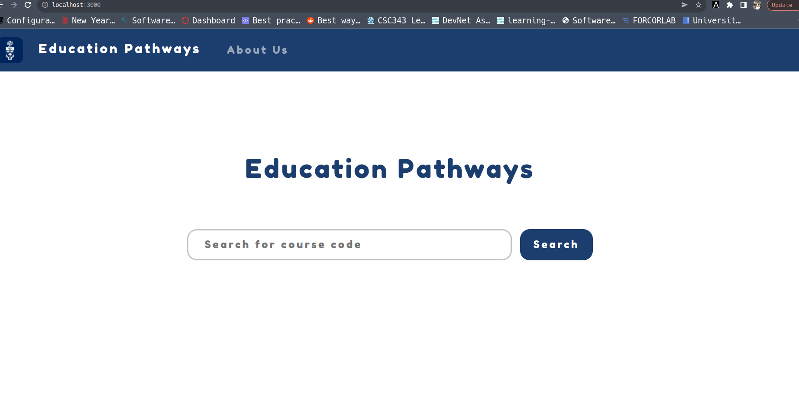

# Education_Pathways

> Name: Chiatzen Wang

> this repo is a clone 
> of https://github.com/ECE444-2022Fall/Assignment_1_starter_template.

This repository host the source code for Education Pathway project. You can view the online deployed version [here](https://assignment-1-starter-template.herokuapp.com/). We are using this repo as a starting point for assignment 1.

## Activity 2

## Activity 3

## Activity 4

